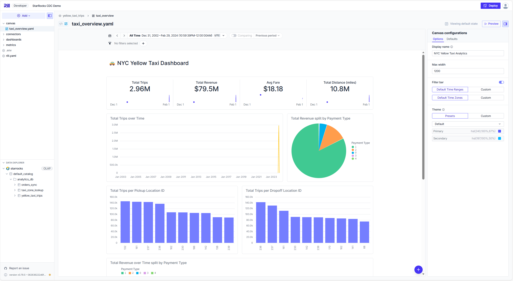

# StarRocks + Rill BI 대시보드 가이드


*NYC Yellow Taxi 데이터를 시각화한 Rill Canvas 대시보드 예시*

이 가이드는 StarRocks 데이터 웨어하우스와 Rill BI 대시보드를 연동하여 실시간 분석 환경을 구축하는 방법을 설명합니다.

## 목차

1. [개요](#1-개요)
2. [아키텍처](#2-아키텍처)
3. [빠른 시작](#3-빠른-시작)
4. [Rill 프로젝트 구조](#4-rill-프로젝트-구조)
5. [Metrics View 이해하기](#5-metrics-view-이해하기)
6. [Canvas 대시보드 만들기](#6-canvas-대시보드-만들기)
7. [검증 및 트러블슈팅](#7-검증-및-트러블슈팅)

---

## 1. 개요

### Rill이란?

[Rill](https://www.rilldata.com/)은 오픈소스 BI 도구로, YAML 기반의 선언적 대시보드를 통해 빠르게 데이터를 시각화할 수 있습니다.

**주요 특징:**
- YAML로 정의하는 Metrics View (dimensions, measures)
- 드래그 앤 드롭 없이 코드로 대시보드 구성
- StarRocks, ClickHouse, DuckDB 등 다양한 OLAP 엔진 지원
- 실시간 쿼리 및 빠른 응답 속도

### StarRocks + Rill 연동 장점

| 장점 | 설명 |
|------|------|
| 고성능 OLAP | StarRocks의 MPP 아키텍처로 대용량 데이터 빠른 분석 |
| 선언적 대시보드 | YAML로 버전 관리 가능한 대시보드 정의 |
| 네트워크 격리 | Rill을 격리된 네트워크에 배치하여 보안 강화 |
| 실시간 갱신 | StarRocks 데이터 변경 시 대시보드 자동 반영 |

### ⚠️ 운영 환경 보안 주의사항

> **데모 환경용 설정 안내**
>
> 이 가이드는 로컬 데모 환경에 적합한 간소화된 자격 증명을 사용합니다.
> 운영(프로덕션) 환경에 배포할 경우 반드시 다음 보안 조치를 적용하세요:
>
> - **Docker Secrets 사용**: 환경 변수 대신 Docker secrets 또는 버전 관리에서 제외된 환경 변수 파일 사용
> - **기본 비밀번호 변경**: 모든 기본 비밀번호를 강력한 비밀번호로 변경
> - **네트워크 보안 정책**: 적절한 방화벽 및 네트워크 격리 정책 구현
> - **SSL/TLS 활성화**: 모든 연결에 대해 암호화 통신 설정
> - **보안 헤더 추가**: Nginx 프록시에 적절한 보안 헤더 구성 (X-Frame-Options, X-Content-Type-Options 등)
> - **접근 제한**: 불필요한 포트 노출 차단 및 인증/인가 메커니즘 적용

---

## 2. 아키텍처

### 네트워크 구성도

```
┌─────────────────────────────────────────────────────────────────┐
│                    External Network                              │
│                                                                  │
│    User Browser ──────► http://localhost:9010                   │
│                              │                                   │
└──────────────────────────────┼───────────────────────────────────┘
                               │
┌──────────────────────────────┼───────────────────────────────────┐
│  starrocks-net               │                                   │
│                              ▼                                   │
│                    ┌─────────────────┐                          │
│                    │  rill-proxy     │                          │
│                    │  (nginx:9009)   │                          │
│                    └────────┬────────┘                          │
│                             │                                    │
│  ┌─────────┐  ┌─────────┐  │                                    │
│  │  MySQL  │  │  MinIO  │  │                                    │
│  │  :3306  │  │  :9000  │  │                                    │
│  └─────────┘  └─────────┘  │                                    │
│                             │                                    │
└─────────────────────────────┼────────────────────────────────────┘
                              │
┌─────────────────────────────┼────────────────────────────────────┐
│  rill-isolated-net          │  (internal: true - 외부 차단)      │
│                             ▼                                    │
│                    ┌─────────────────┐                          │
│                    │      Rill       │                          │
│                    │   (내부:9009)   │                          │
│                    └────────┬────────┘                          │
│                             │                                    │
│                             ▼                                    │
│  ┌──────────────────────────────────────────────────────┐       │
│  │              StarRocks Cluster                        │       │
│  │  ┌──────────────┐         ┌──────────────────┐       │       │
│  │  │     FE       │◄───────►│    BE / CN       │       │       │
│  │  │   :9030      │         │     :9050        │       │       │
│  │  └──────────────┘         └──────────────────┘       │       │
│  └──────────────────────────────────────────────────────┘       │
│                                                                  │
└──────────────────────────────────────────────────────────────────┘
```

### 네트워크 격리 설명

| 네트워크 | 특성 | 연결된 서비스 |
|----------|------|---------------|
| `starrocks-net` | 일반 브릿지 네트워크 | MySQL, MinIO, rill-proxy |
| `rill-isolated-net` | 내부 전용 (`internal: true`) | Rill, StarRocks FE/BE |

**격리 효과:**
- Rill은 StarRocks에만 접근 가능
- MySQL, MinIO 등 다른 데이터 소스 접근 차단
- nginx 프록시를 통해서만 외부에서 Rill 접근 가능

---

## 3. 빠른 시작

### 사전 요구사항

- Docker & Docker Compose 설치
- 최소 8GB RAM 권장
- 포트 9010 (Rill), 8030 (StarRocks Web UI), 9030 (StarRocks Query) 사용 가능

### 환경 시작

```bash
# BE 모드 + Rill 시작
docker compose --profile be --profile rill up -d

# 또는 CN 모드 + Rill 시작 (S3 스토리지 사용)
docker compose --profile cn --profile rill up -d
```

### 상태 확인

```bash
# 서비스 상태 확인
docker compose --profile be --profile rill ps

# Rill 로그 확인
docker logs -f rill
```

### 접속 정보

| 서비스 | URL | 용도 |
|--------|-----|------|
| Rill Dashboard | http://localhost:9010 | BI 대시보드 |
| StarRocks Web UI | http://localhost:8030 | StarRocks 관리 |
| StarRocks Query | localhost:9030 | SQL 쿼리 (MySQL 프로토콜) |

### 데이터베이스 접속

```bash
# StarRocks 접속
mysql -h 127.0.0.1 -P 9030 -u root -p'starrocks_demo_pw1#'

# 샘플 데이터 확인
USE analytics_db;
SELECT COUNT(*) FROM yellow_taxi_trips;
```

---

## 4. Rill 프로젝트 구조

Rill 프로젝트는 `rill-project/` 디렉토리에 위치합니다.

```
rill-project/
├── rill.yaml              # 프로젝트 설정
├── .env                   # 환경 변수 (비밀번호 등)
├── connectors/
│   └── starrocks.yaml     # StarRocks 연결 설정
├── metrics/
│   └── yellow_taxi_trips.yaml  # Metrics View 정의
└── canvas/                # 대시보드 (사용자가 직접 생성)
    └── (여기에 대시보드 YAML 추가)
```

### 4.1 rill.yaml

프로젝트 기본 설정 파일입니다.

```yaml
compiler: rillv1

title: "StarRocks CDC Demo"
description: "StarRocks 데이터 분석 대시보드"

olap_connector: starrocks
```

### 4.2 connectors/starrocks.yaml

StarRocks 데이터베이스 연결 설정입니다.

```yaml
type: connector
driver: starrocks
host: "starrocks-fe"
port: 9030
username: "root"
password: "{{ .env.connector.starrocks.password }}"
database: "analytics_db"
ssl: false
log_queries: true
```

> **참고**: 비밀번호는 `.env` 파일의 `connector.starrocks.password` 변수를 참조합니다.

### 4.3 .env

환경 변수 파일입니다.

```
connector.starrocks.password=starrocks_demo_pw1#
```

---

## 5. Metrics View 이해하기

Metrics View는 Rill의 핵심 개념으로, 분석할 데이터의 dimensions(차원)과 measures(측정값)를 정의합니다.

### 5.1 기본 구조

```yaml
version: 1
type: metrics_view

display_name: "대시보드 이름"
description: "설명"

database: default_catalog
database_schema: analytics_db
model: 테이블명

timeseries: 시간컬럼
smallest_time_grain: month  # 최소 시간 단위

dimensions:
  - name: 컬럼명
    display_name: "표시명"
    column: 컬럼명

measures:
  - name: 측정값이름
    display_name: "표시명"
    expression: "SQL 집계함수"
    format_preset: humanize  # 또는 currency_usd, percent 등
```

### 5.2 샘플 Metrics View 분석

`metrics/yellow_taxi_trips.yaml` 파일을 살펴봅니다.

**Dimensions (6개):**

| Dimension | 설명 |
|-----------|------|
| `VendorID` | 택시 회사 ID |
| `PULocationID` | 픽업 위치 ID |
| `DOLocationID` | 하차 위치 ID |
| `payment_type` | 결제 방식 (1=신용카드, 2=현금 등) |
| `RatecodeID` | 요금 코드 |
| `store_and_fwd_flag` | 저장 후 전송 플래그 |

**Measures (12개):**

| Measure | Expression | 설명 |
|---------|------------|------|
| `total_trips` | `COUNT(*)` | 총 운행 수 |
| `total_passengers` | `SUM(passenger_count)` | 총 승객 수 |
| `total_distance` | `SUM(trip_distance)` | 총 이동 거리 (마일) |
| `total_fare` | `SUM(fare_amount)` | 총 요금 |
| `total_tips` | `SUM(tip_amount)` | 총 팁 |
| `total_revenue` | `SUM(total_amount)` | 총 수익 |
| `avg_fare` | `AVG(fare_amount)` | 평균 요금 |
| `avg_tip` | `AVG(tip_amount)` | 평균 팁 |

### 5.3 시계열 설정

```yaml
timeseries: tpep_pickup_datetime
smallest_time_grain: month
```

- `timeseries`: 시간 축으로 사용할 컬럼
- `smallest_time_grain`: 최소 시간 단위 (second, minute, hour, day, week, month, year)

> **중요**: 데이터 범위가 넓으면 `smallest_time_grain`을 크게 설정해야 합니다.
> Rill은 시계열 차트에서 최대 1500개의 시간 구간(bins)만 허용합니다.

---

## 6. Canvas 대시보드 만들기

Canvas는 Rill의 대시보드 레이아웃을 정의하는 YAML 파일입니다.

### 6.1 기본 구조

```yaml
type: canvas
display_name: "대시보드 이름"
defaults:
  time_range: inf          # 전체 시간 범위
  comparison_mode: none    # 비교 모드 없음

rows:
  - items:
      - 컴포넌트:
          속성: 값
        width: 12          # 너비 (12 그리드 기준)
```

**width 설정 예시:**
- `width: 12` - 전체 너비
- `width: 6` - 절반 (2개 배치 시)
- `width: 4` - 1/3 (3개 배치 시)
- `width: 8` + `width: 4` - 2:1 비율

### 6.2 KPI Grid 추가

주요 지표를 카드 형태로 표시합니다.

```yaml
rows:
  - items:
      - kpi_grid:
          metrics_view: yellow_taxi_trips
          measures:
            - total_trips
            - total_revenue
            - avg_fare
            - total_distance
        width: 12
```

### 6.3 Line Chart 추가

시계열 데이터를 선 그래프로 표시합니다.

```yaml
rows:
  - items:
      - line_chart:
          metrics_view: yellow_taxi_trips
          x:
            field: tpep_pickup_datetime
            type: temporal
            time_grain: month    # 월별 집계
          y:
            field: total_trips
            type: quantitative
        width: 8
```

> **참고**: `time_grain`은 `smallest_time_grain` 이상이어야 합니다.

### 6.4 Bar Chart 추가

카테고리별 데이터를 막대 그래프로 표시합니다.

```yaml
rows:
  - items:
      - bar_chart:
          metrics_view: yellow_taxi_trips
          x:
            field: PULocationID
            type: nominal
            limit: 10           # 상위 10개
            sort: -y            # y값 내림차순
          y:
            field: total_trips
            type: quantitative
        width: 6
```

### 6.5 Donut Chart 추가

비율을 원형 차트로 표시합니다.

```yaml
rows:
  - items:
      - donut_chart:
          metrics_view: yellow_taxi_trips
          color:
            field: payment_type
            type: nominal
            limit: 5
          theta:
            field: total_revenue
            type: quantitative
        width: 4
```

### 6.6 Stacked Bar Chart 추가

시계열 데이터를 카테고리별로 누적 표시합니다.

```yaml
rows:
  - items:
      - stacked_bar:
          metrics_view: yellow_taxi_trips
          x:
            field: tpep_pickup_datetime
            type: temporal
            time_grain: month
          y:
            field: total_revenue
            type: quantitative
            zeroBasedOrigin: true
          color:
            field: payment_type
            type: nominal
        width: 12
```

### 6.7 Markdown 추가

텍스트 설명이나 제목을 추가합니다.

```yaml
rows:
  - items:
      - markdown:
          content: "# NYC Yellow Taxi Dashboard"
        width: 12
```

### 6.8 완성된 예제

아래 YAML을 `rill-project/canvas/taxi_overview.yaml`로 저장하세요.

```yaml
# canvas/taxi_overview.yaml
type: canvas
display_name: "NYC Yellow Taxi Analytics"
defaults:
  time_range: inf
  comparison_mode: none

rows:
  # Row 1: 제목
  - items:
      - markdown:
          content: "# NYC Yellow Taxi Dashboard"
        width: 12

  # Row 2: KPI Cards
  - items:
      - kpi_grid:
          metrics_view: yellow_taxi_trips
          measures:
            - total_trips
            - total_revenue
            - avg_fare
            - total_distance
        width: 12

  # Row 3: 시계열 + 파이차트
  - items:
      - line_chart:
          color: hsl(45, 99%, 50%)
          metrics_view: yellow_taxi_trips
          x:
            field: tpep_pickup_datetime
            type: temporal
            time_grain: month
          y:
            field: total_trips
            type: quantitative
        width: 8
      - donut_chart:
          metrics_view: yellow_taxi_trips
          color:
            field: payment_type
            type: nominal
            limit: 5
          theta:
            field: total_revenue
            type: quantitative
        width: 4

  # Row 4: 픽업/하차 위치별 분석
  - items:
      - bar_chart:
          metrics_view: yellow_taxi_trips
          x:
            field: PULocationID
            type: nominal
            limit: 10
            sort: -y
          y:
            field: total_trips
            type: quantitative
        width: 6
      - bar_chart:
          metrics_view: yellow_taxi_trips
          x:
            field: DOLocationID
            type: nominal
            limit: 10
            sort: -y
          y:
            field: total_trips
            type: quantitative
        width: 6

  # Row 5: 시간별 수익 (결제 방식별 누적)
  - items:
      - stacked_bar:
          metrics_view: yellow_taxi_trips
          x:
            field: tpep_pickup_datetime
            type: temporal
            time_grain: month
          y:
            field: total_revenue
            type: quantitative
            zeroBasedOrigin: true
          color:
            field: payment_type
            type: nominal
        width: 12

  # Row 6: Vendor별 + Tips 분석
  - items:
      - bar_chart:
          metrics_view: yellow_taxi_trips
          x:
            field: VendorID
            type: nominal
          y:
            field: total_trips
            type: quantitative
        width: 6
      - bar_chart:
          metrics_view: yellow_taxi_trips
          x:
            field: payment_type
            type: nominal
          y:
            field: total_tips
            type: quantitative
        width: 6
```

### 대시보드 확인

파일 저장 후 Rill이 자동으로 감지합니다.
브라우저에서 확인: http://localhost:9010/files/canvas/taxi_overview.yaml

---

## 7. 검증 및 트러블슈팅

### 7.1 네트워크 격리 확인

```bash
# Rill 컨테이너에서 MySQL 접근 불가 확인
docker exec -it rill sh -c "ping -c 2 mysql 2>&1 || echo 'MySQL 접근 차단됨 (정상)'"

# Rill 컨테이너에서 StarRocks 접근 가능 확인
docker exec -it rill sh -c "ping -c 2 starrocks-fe && echo 'StarRocks 접근 성공'"
```

### 7.2 네트워크 연결 상태 확인

```bash
# Rill이 rill-isolated-net에만 연결되었는지 확인
docker inspect rill --format='{{range $k,$v := .NetworkSettings.Networks}}{{$k}} {{end}}'
# 예상 출력: starrocks_demo_rill-isolated-net

# StarRocks FE가 양쪽 네트워크에 연결되었는지 확인
docker inspect starrocks-fe --format='{{range $k,$v := .NetworkSettings.Networks}}{{$k}} {{end}}'
# 예상 출력: starrocks_demo_starrocks-net starrocks_demo_rill-isolated-net
```

### 7.3 일반적인 오류와 해결책

#### "time range has more than 1500 bins" 오류

**원인**: 시계열 데이터 범위가 너무 넓어 시간 구간이 1500개를 초과

**해결**:
1. `smallest_time_grain`을 더 큰 단위로 변경 (예: `day` → `month`)
2. Canvas의 `time_grain`을 더 큰 단위로 설정

```yaml
# metrics view
smallest_time_grain: month

# canvas line_chart
x:
  field: tpep_pickup_datetime
  type: temporal
  time_grain: month
```

#### "500 Error connecting to runtime" 오류

**원인**: Rill 서버 연결 문제

**해결**:
```bash
# Rill 재시작
docker restart rill

# 로그 확인
docker logs -f rill
```

#### StarRocks 연결 실패

**원인**: StarRocks가 아직 준비되지 않음

**해결**:
```bash
# StarRocks 상태 확인
docker logs starrocks-fe | tail -20

# StarRocks 준비 대기 (보통 60초 소요)
docker exec -it starrocks-fe mysql -P 9030 -u root -p'starrocks_demo_pw1#' -e "SHOW DATABASES;"
```

#### Canvas가 화면에 표시되지 않음

**원인**: YAML 문법 오류

**해결**:
```bash
# Rill 로그에서 파싱 오류 확인
docker logs rill 2>&1 | grep -i "error\|fail"
```

### 7.4 Rill 로그 확인

```bash
# 실시간 로그
docker logs -f rill

# 최근 오류만 확인
docker logs rill 2>&1 | grep -i "error\|warn" | tail -20
```

---

## 부록: 샘플 데이터 정보

### yellow_taxi_trips 테이블

NYC Yellow Taxi 2024년 1월 운행 데이터 (약 300만 건)

| 컬럼 | 타입 | 설명 |
|------|------|------|
| VendorID | INT | 택시 회사 ID (1, 2, 6) |
| tpep_pickup_datetime | DATETIME | 픽업 시간 |
| tpep_dropoff_datetime | DATETIME | 하차 시간 |
| passenger_count | DOUBLE | 승객 수 |
| trip_distance | DOUBLE | 이동 거리 (마일) |
| PULocationID | INT | 픽업 위치 ID |
| DOLocationID | INT | 하차 위치 ID |
| payment_type | BIGINT | 결제 방식 |
| fare_amount | DOUBLE | 기본 요금 |
| tip_amount | DOUBLE | 팁 |
| total_amount | DOUBLE | 총 금액 |

**payment_type 코드:**
- 1 = Credit card
- 2 = Cash
- 3 = No charge
- 4 = Dispute
- 0 = Unknown

---

## 참고 자료

- [Rill 공식 문서](https://docs.rilldata.com/)
- [StarRocks 공식 문서](https://docs.starrocks.io/)
- [NYC TLC Trip Record Data](https://www.nyc.gov/site/tlc/about/tlc-trip-record-data.page)
